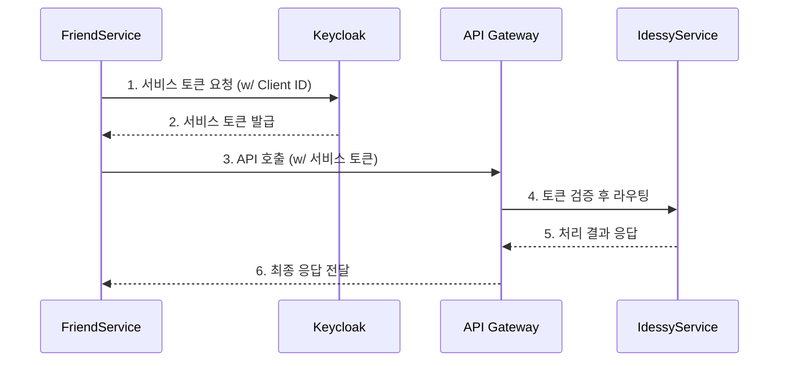

# Orielle Service-to-Service (S2S) Communication Architecture

- **Version**: 1.1 (Diagram Corrected)
- **Author**: BeomKyu, Orielle 프로젝트 컨설턴트
- **Status**: FINALIZED

## 1. 핵심 원칙
Orielle 플랫폼의 모든 마이크로서비스는 서로를 직접 호출하지 않으며, **오직 API Gateway를 통해서만 통신하는 것을 원칙**으로 한다. 이는 플랫폼 전체의 보안, 관측 가능성, 통제 용이성을 확보하기 위함이다.

## 2. 참여 주체 및 역할
S2S 통신은 4개의 핵심 주체가 협력하여 이루어진다.

- **Keycloak (신원 제공자, Identity Provider)**
    - 역할: 각 내부 서비스(`IdessyService`, `FriendService` 등)에 대한 '서비스 계정'(`Client ID/Secret`)을 발급하고 관리한다. 다른 서비스를 호출하는 데 필요한 '서비스 계정 토큰'을 발급해주는 주체다.

- **API Gateway (교통 통제관, Enforcer)**
    - 역할: 모든 서비스 간의 통신이 자신을 통과하도록 강제한다. 들어온 서비스 계정 토큰이 유효한지 검증하고, 요청을 올바른 목적지 서비스로 라우팅한다.

- **Utils-Internal 모듈 (통신 도구함, Toolkit)**
    - 역할: 각 서비스가 Keycloak으로부터 서비스 계정 토큰을 발급받고, 다른 서비스를 호출할 때 해당 토큰을 HTTP 헤더에 자동으로 추가하는 등의 반복적인 로직을 표준화된 코드로 제공한다.

- **개별 마이크로서비스 (통신 주체, Actor)**
    - 역할: `Utils-Internal` 모듈을 사용하여 다른 서비스의 API를 마치 내부 함수처럼 쉽게 호출한다.

## 3. 통신 흐름 (Client Credentials Grant)
`FriendService`가 `IdessyService`의 정보를 필요로 할 때의 통신 흐름은 다음과 같습니다.

### 단계별 흐름 설명

1.  **`[FriendService -> Keycloak]` 토큰 요청**:
    -   `FriendService`가 통신을 시작하기 전, 자신의 `Client ID/Secret`을 이용해 Keycloak에 "나 `FriendService`인데, 다른 서비스에 방문할 수 있는 출입증(서비스 토큰) 좀 발급해줘" 라고 요청합니다.
    -   이 과정은 `Utils-Internal` 모듈이 내부적으로 처리하여, `FriendService` 개발자는 이 단계를 신경 쓸 필요가 없습니다.

2.  **`[Keycloak -> FriendService]` 토큰 발급**:
    -   Keycloak은 `FriendService`의 신원을 확인하고, 다른 내부 서비스를 호출할 수 있는 권한이 담긴 단기(short-lived) 서비스 토큰을 발급하여 `FriendService`에게 전달합니다.

3.  **`[FriendService -> API Gateway]` API 호출**:
    -   `FriendService`는 방금 발급받은 서비스 토큰을 `Authorization` 헤더에 담아, API Gateway를 통해 `IdessyService`의 API(예: `/api/idessy/{id}`)를 호출합니다.

4.  **`[API Gateway -> IdessyService]` 검증 및 라우팅**:
    -   API Gateway는 `FriendService`가 보낸 요청을 받아, 토큰이 Keycloak에 의해 발급된 유효한 내부 서비스 토큰인지 검증합니다.
    -   검증이 완료되면, 요청을 실제 `IdessyService`로 안전하게 전달(라우팅)합니다.

5.  **`[IdessyService -> ... -> FriendService]` 응답**:
    -   `IdessyService`는 요청을 처리하고, 그 결과를 다시 API Gateway를 통해 `FriendService`에게 최종적으로 전달합니다.

### 시각적 흐름도

이 아키텍처를 통해, 각 서비스는 상대방의 네트워크 위치를 알 필요 없이 오직 API Gateway의 주소만 알면 되며, 모든 내부 통신이 중앙에서 기록되고 통제됩니다.