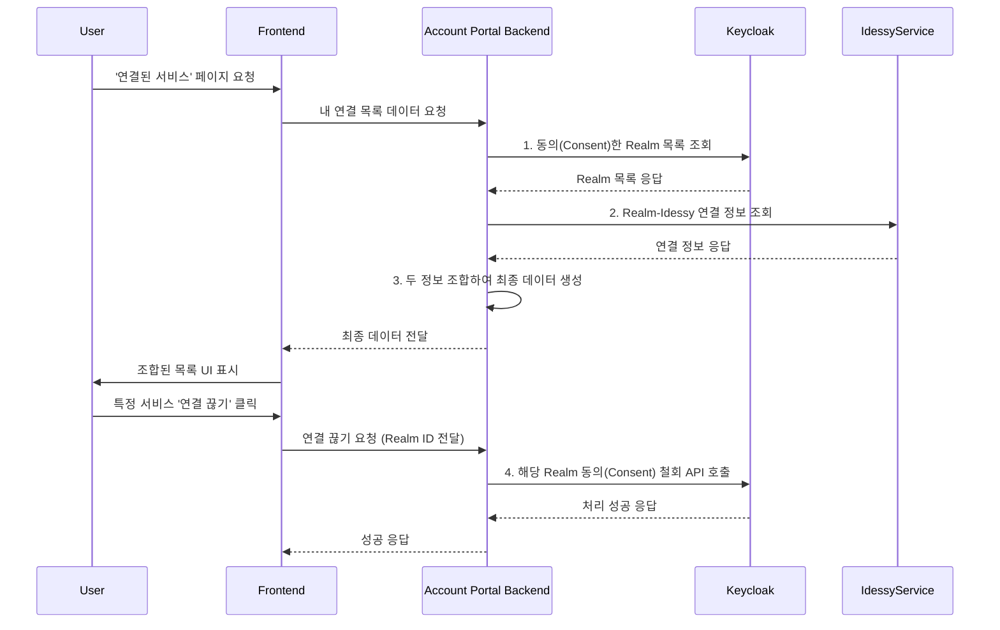

# Orielle Account Portal Design Document

- **Version**: 1.0
- **Tier**: 4 (First-Party Ventures)
- **Author**: BeomKyu, Orielle 프로젝트 컨설턴트
- **Status**: DRAFT

## 1. 서비스 개요
'Orielle 계정 포털'은 최종 사용자가 자신의 Orielle 계정 정보와 보안 설정을 직접 관리하고, 외부 서비스(Realm)와의 연결 상태를 통제할 수 있는 **중앙 대시보드**입니다.

이 서비스는 Tier 0의 기반 API들을 **'사용'**하여 최종 사용자에게 UI를 제공하는 **'응용 프로그램(Application)'**이므로, Orielle이 직접 사용자에게 가치를 제공하는 Tier 4 서비스로 분류됩니다.

## 2. 아키텍처 원칙

### 1. BFF (Backend for Frontend) 패턴 채택
이 서비스는 독립적인 **Frontend**와, 이 Frontend만을 위한 전용 **Backend(BFF)**를 가지는 마이크로서비스로 설계합니다.

- **분리 이유**:
    - **독립적인 개발 및 배포**: Frontend 팀과 Backend 팀은 API 명세만 맞으면 서로의 일정에 구애받지 않고 자유롭게 개발하고 배포할 수 있어 전체 개발 속도가 향상됩니다.
    - **API 오케스트레이션**: Frontend가 Keycloak API와 IdessyService API를 각각 호출하여 정보를 조합하는 복잡한 로직을 수행하는 대신, BFF가 서버 환경에서 이 모든 작업을 처리하여 Frontend에게는 **"최종적으로 정제된 데이터"**만 한번에 전달합니다. 이를 통해 Frontend는 단순하고 가벼워집니다.
    - **보안 강화**: Keycloak Admin API 호출과 같은 민감한 로직을 신뢰할 수 없는 브라우저 환경(Frontend)이 아닌, 통제된 서버 환경(BFF)에서 처리하여 보안을 강화합니다.

### 2. '조립자(Assembler)' 역할 수행
이 서비스는 스스로 데이터를 소유하기보다, **Keycloak**과 **IdessyService** 등 핵심 기반 서비스들의 API를 호출하고 그 결과를 사용자 친화적인 UI로 보여주는 **'조립자(Assembler)'이자 '외관(Facade)'** 역할을 수행합니다.

## 3. 핵심 기능
- [x] **계정 프로필 관리**: 사용자의 이름, 이메일 등 기본 정보를 조회하고 수정합니다.
- [x] **보안 설정 관리**: 비밀번호 변경, 2단계 인증(MFA) 설정 등 핵심 보안 기능을 관리합니다.
- [x] **연결된 서비스 관리 (권한 사후 관리)**: 외부 서비스(Realm)에 부여된 권한을 확인하고, 연결을 끊을 수 있는 기능을 제공합니다.
- [x] **로그인 활동 조회**: 최근 로그인 기록 및 활성화된 세션을 확인하고 강제 로그아웃 시킬 수 있습니다.

## 4. 핵심 로직 흐름: '연결된 서비스 관리'

 - [BFF -> Keycloak]: BFF는 Keycloak Admin API를 호출하여 사용자가 '동의'한 Realm 목록을 가져옵니다.

 - [BFF -> IdessyService]: BFF는 IdessyService의 내부 API를 호출하여, 각 Realm 연결에 어떤 Idessy가 사용되었는지 정보를 가져옵니다.

 - [BFF -> BFF]: BFF는 두 정보를 조합하여 Frontend가 바로 렌더링할 수 있는 최종 데이터를 만듭니다.

 - [BFF -> Keycloak]: 사용자가 연결 끊기를 요청하면, BFF는 Keycloak Admin API를 호출하여 해당 Realm과의 동의를 철회하고 모든 관련 토큰을 무효화시킵니다.

## 5.데이터 모델 (ERD)
   - 이 서비스는 원칙적으로 자체 데이터베이스를 최소화합니다. 대부분의 정보는 Keycloak과 IdessyService에서 실시간으로 가져옵니다. (필요시 캐싱이나 포털 자체의 사용자 설정 저장을 위한 최소한의 테이블만 가질 수 있습니다.)